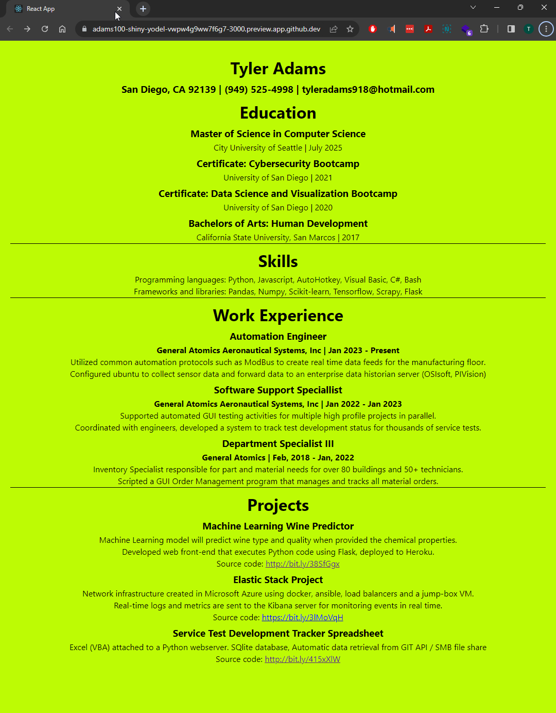

Applicatin created using react template: create-react-app

The input-process-output model involves 3 steps
INPUT
Input is provided to the application in a raw form, also referred to as a program requirement.

PROCESS
The application manipulates or makes calculations on the raw data.  Most of the logic is done at this stage to transform the data into something that is useful or more easily consumed 

OUTPUT
The application produces the manipulated data.  It should be noted that this process sets the stage for dynamic and automated data transformation.

.

