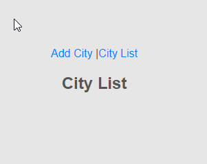
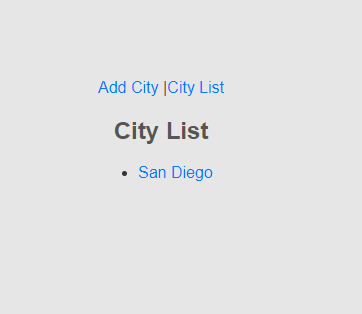
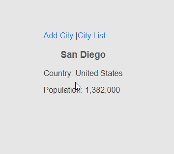

# INPUT
  Input is provided by the user in terms of typing a city, country and population in an edit box
# PROCESS
  Based on user input, tasks will be added to the list

# OUTPUT
  The items on the list will grow as the user inserts them, the details page will show the country and population of the city
  

